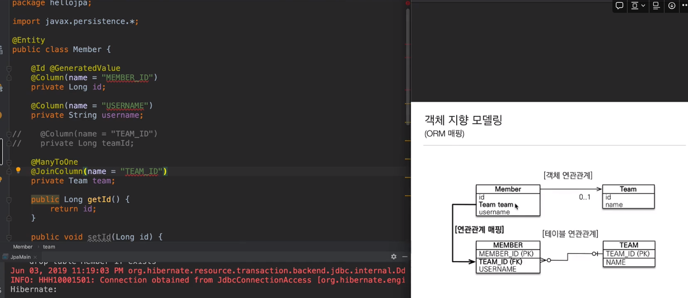

# Study

### Entity 연관관계
> <strong> 양방향 연관관계일 때는 각각의 엔티티를 1:N 형식의 단방향으로 만들어서 설계할 것</strong> 

> N:1 중 N이 무조건 연관관계의 주인
- 해당 프로젝트 예시 (ACCOUNT가 주인이 됨)
  - 한 명의 사용자는 여러 계좌를 만들 수 있음 >> USER(1) <-> ACCOUNT(N)

연관관계의 주인(Owner)  
-> 연관관계의 주인만이 외래키를 등록(등록 및 수정)  
-> 주인이 아닌 쪽은 읽기만 가능  
-> 주인은 MappedBy속성 X 

### DB 의 외래키 != 객체의 참조 
- DB의 외래키로 객체를 모델링 하면 안되는 이유   
-> DB 의 외래키처럼 객체를 모델링하면, 객체지향적이지 않고 객체간의 협력관계가 모호해진다.

> MEMBER :: 주인
---

